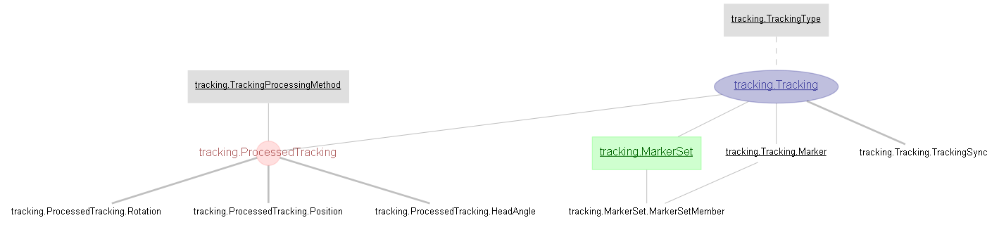
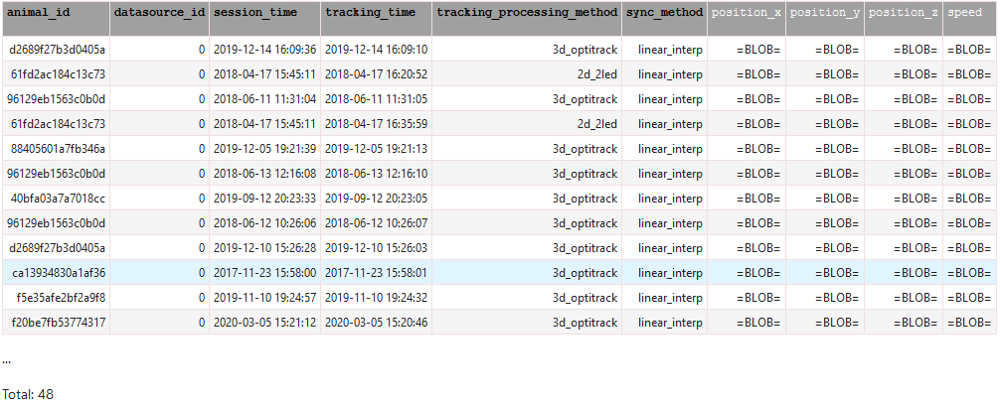
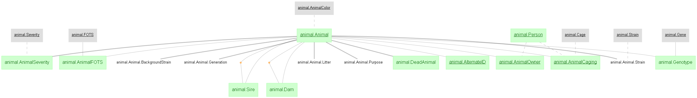
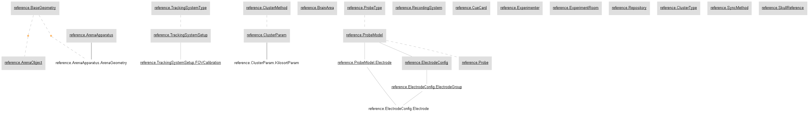
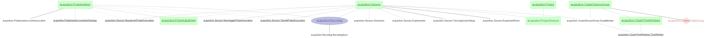

## Finding your data

The pipeline comprises of a large number of interlinked tables, storing all of the relevant data and metadata. A common problem for new users is finding out where to look for the data they need.

The pipeline is broken down into 7 thematic `schemas`:

```python
import datajoint as dj
import matplotlib.pyplot as plt

animal = dj.create_virtual_module('animal', 'prod_mlims_data')
reference = dj.create_virtual_module('reference', 'group_shared_reference')
acquisition = dj.create_virtual_module('acquisition', 'group_shared_acquisition')
tracking = dj.create_virtual_module('tracking', 'group_shared_tracking')
behavior = dj.create_virtual_module('behavior', 'group_shared_behavior')
ephys = dj.create_virtual_module('ephys', 'group_shared_ephys')
analysis = dj.create_virtual_module('analysis', 'group_shared_analysis')
```

A schema can be explored with datajoint's `Diagram` method (relies on the `graphviz` package and binary). Jupyter is the recommended environment, although diagrams can also be shown via matplotlib:
```python
# In Jupyter
dj.Diagram(tracking)
# or using Matplotlib
diagram = dj.Digram(tracking)
plt.figure()
diagram.draw()
```



Individual tables can then be explored for specific columns. Formatting is easier to read in Jupyter, but can be reproduced in standard Python terminals as well:
```python
tracking.ProcessedTracking.Position()
```


Column names in **bold** are primary key columns - i.e. the minimum information required to guarantee uniqueness. Displaying information in this way does not retrieve the information in a way you can usefully use, but displays an abridged visualisation of the table. It is a useful and quick way of testing restrictions to be be sure it gets the number of responses you expect

Retrieving the data itself can be done with the `.fetch()` or `.fetch1()` methods. 
```python
(tracking.ProcessedTracking.Position & {"animal_id":"d2689f27b3d0405a", "session_time": "2019-12-14 16:09:36", "tracking_time":"2019-12-14 16:09:10"}).fetch1()
```
```python
{'animal_id': 'd2689f27b3d0405a',
 'datasource_id': 0,
 'session_time': datetime.datetime(2019, 12, 14, 16, 9, 36),
 'tracking_time': datetime.datetime(2019, 12, 14, 16, 9, 10),
 'tracking_processing_method': '3d_optitrack',
 'sync_method': 'linear_interp',
 'position_x': array([30.394226, 31.314314, 31.540241, ..., 65.26187 , 65.24989 ,
        65.25064 ], dtype=float32),
 'position_y': array([-37.433163, -37.048393, -36.952393, ...,  32.50731 ,  32.512386,
         32.50953 ], dtype=float32),
 'position_z': array([5.9365683, 6.1301165, 6.1709847, ..., 1.9855611, 1.9907604,
        1.9915823], dtype=float32),
 'speed': array([ 8.95713713, 18.67057498, 27.29383278, ...,  0.81637054,
         0.9167124 ,  0.72636972])}
```


### `animal`

The `animal` schema contains data about specific animals, imported from the mLims colony management systems in use at Kavli and St Olav's hospital. It has one major table, `animal.Animal` (note the capitalisation)

Animals are uniquely identified by two fields, `animal_id` and `datasource_id`. `datasource_id` is invariably 0, and is included for future proofing the pipeline against additional data sources beyond mLims. 

`animal_id` can be looked up based on the common numerical numbers used at Kavli, which are stored as `animal_name`. For example:
```python
(animal.Animal & {"animal_id":26230}).fetch1("animal_id")
```
```python
'26230d0994da68a3'
```


### `reference`

The `reference` schema stores details that other schemas rely upon. The most relevant tables are:

##### Arenas
```python
reference.ArenaApparatus
reference.ArenaApparatus.ArenaGeometry
```
Tables containing the various arenas in use and their dimensions. If the arena you need is not yet included, you can add new arenas via the web gui. 
##### Probes
```python
reference.Probe
```
Specific probe instances, e.g. corresponding to a single serial-numbered Neuropixel probe. 


### `acquisition`


Tables relating to raw data from experiments
```python
acquisition.ProbeInsertion
acquisition.Session
acquisition.Recording
acquisition.Project
acquisition.ProjectSession
```


### `ephys`


### `behavior`


### `tracking`


### `analysis`
