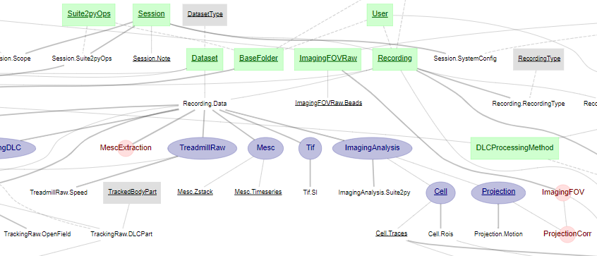
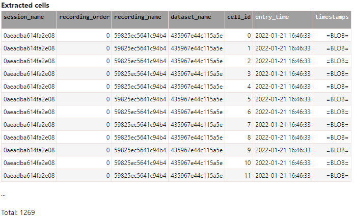
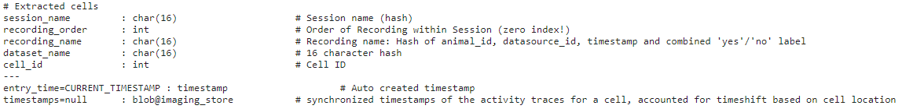

## How to find what you need

Both pipelines are large, complex networks of schemas, tables, and columns. Here are some general suggestions to help you find what you need. There are further suggestions, specific to each pipeline, in the relevant sections.

### Finding a table: the Diagram

Datajoint includes a Diagram feature, to display the pipeline as a connected network. This can operate either on a _schema_ object, or a table, or some combination of the two. You may also see the keyword "ERD" used in places - this is a more mathematically correct description ("entity relationship diagram"), but it means the same thing, and executes exactly the same Python code to give you a graphical output. 

**Electrophysiology:** view the ephys diagram

```python
import datajoint as dj

ephys = dj.create_virtual_module("ephys", "group_shared_ephys")
dj.Diagram(ephys)
```


*Image showing the entire ephys diagram (note: the ephys pipeline also contains other schemas, such as one for analysis and one for behaviour).*

**Imaging:** view the entire imaging pipeline diagram

```python
import datajoint as dj

schema = dj.schema(dj.config["custom"]["dj_imaging.database"])
schema.spawn_missing_classes()
dj.ERD(schema)
```

*Image showing part of the imaging schema.*


###### What do the colours mean?

*Examples are from the imaging schema*

* **Grey (lookup) or Green (manual):** data gathered from outside the pipeline

    Small tables containing general facts, settings or other data entered by hand or with external helper scripts. 
   
    E.g. `MiceDevelopProject` contains a list of animals and the additional names they were given for a developmental project.

    E.g. `BaseFolder` contains the information provided by the user when ingesting data, such as via the [Web GUI](http://2p.neuroballs.net:5000/)

* **Purple (imported):** data generated within the pipeline based on data from outside

    The content is computed automatically inside the pipeline but access to data outside the pipeline is required to do so.
    
    E.g. `TrackingRaw` gathers info on time stamps and sampling rate but requires access to the ingested data files to retrieve it.

* **Red (computed):** data generated entirely within the pipeline

    Data computed automatically entirely inside the pipeline. 
    
    E.g. `Suite2py` contains information about Suite2P python jobs that the pipeline has executed.

* **No colour/white (part table):** a 'sub-table' to the preceding 'master/parent' table

    Some tables would get very big if all the data computed was put into a single table. Instead, the data is split up/organised into 'sub-tables' that are intrinsically linked to their 'master table'.

    E.g. `Cell` gathers data from Suite2p, which is very rich. Two part tables are therefore used instead of one, categorising the data into `Cell.Traces` (dF/F trace etc.) and `Cell.Rois` (number of pixels, ellipticity etc.). Their master table `Cell` only contains a `cell_id` for referencing.

    E.g. `Ratemap` contains data on ratemaps, such as the number of fields. But each field within a ratemap also has a number of values associated with it, such as peak rate. These are saved in `Ratemap.Fields`. I.e. unlike the example above, these tables do not have the same size: for each ratemap (one row in `Ratemap`) there are multiple fields (saved as multiple rows in `Ratemap.Fields`).

For more info on these table types, check out the [Datajoint website](https://docs.datajoint.io/python/definition/05-Data-Tiers.html).


###### Viewing smaller sections of the Diagram


The Diagram can help you find your way to the right table, although in some cases, the resulting output can be so overwhelmingly large, that it's just not useful.

You can also search a specific area of the pipeline. If you know about a specific table, and want to know about its "neighbours", you can use the diagram a bit like an equation, requesting a certain number of neighbours above or below the table. For example:

**Ephys**

```python
dj.Diagram(ephys.Spikes) +2
```

**Imaging:** visualise the table structure two levels on from the `Cell` table
```python
dj.ERD(Cell)+2
```

*The `Cell` table has two part tables, `Cell.Rois` and `Cell.Traces`. The `Cell.Traces` table is used by `Cell.Spikes`, in which spikes inferred from the traces are stored. These are then filtered in `FilteredSpikes`.*


You can also add diagrams together - or subtract - to get a more complex overview that keeps or avoids certain sections of the network

**Ephys:** view only specified parts of the diagram

```python
analysis = dj.create_virtual_module("analysis", "group_shared_analysis")
dj.Diagram(ephys) + dj.Diagram(analysis) - dj.Diagram(analysis.ShuffledScores)
```
**Imaging:** view only specified parts of the diagram

```python
dj.ERD(Session)+dj.ERD(Cell)+dj.ERD(ImagingAnalysis)
```


### Finding the data you need: columns

Having found a relevant table, you need to know if it contains the information you need and if so, how to retrieve it. I.e. you need to know which column name to search for. Here, there are numerous options (Option 1 and Option 3 are perhaps the most useful ones).

###### Option 1

One option is simply to print out a representation of the table itself. This prints out a nicely formatted dataframe, showing all of the columns in that table and their names:

**Ephys**

```python
ephys.CuratedClustering()
```

**Imaging:** check what is in the `Cell` table

```python
Cell()
```

*The `Cell` table contains five primary keys (black font) and one non-primary key (white font) for each and every cell within the database (at the time of writing: >340 000 cells).*


###### Option 2

Alternatively, you can use one of the helper methods provided by Datajoint. This prints out the text definition that was used to _create_ the table, including any comments that were associated with those columns. However, it can hide some of the column names, as they are implicit in the description, as references to other tables:

**Ephys**
```python
ephys.CuratedClustering.describe()
```

**Imaging:** view a (limited) description of the `Cell` table

```python
Cell.describe()
```

*The `---` separates between primary (above) and non-primary (below) attributes, and can typically be thought of as:* 

+ *the "things" needed to perform the computation*
+ *the results of the computation*


###### Option 3

Another alternative, that includes every column name and comment is the _heading_:

**Ephys**
```python
ephys.CuratedClustering.heading
```
**Imaging:** view every column name of the `Cell` table

```python
Cell.heading
```

*Unlike `.describe()`, `.heading` lists every single column name for the table in question.*


### Searching for a specific column name

Sometimes, you need to go the other way around - you know (or suspect) a column name, but don't know what table it is in. This is... a bit harder to do, and Datajoint doesn't yet provide very good tools for it, although development work is on-going

The below function provides a fragile workaround to the problem: if you know the _precise_ name of the column you want, then it will help. It implements exact, case-sensitive matching, so it will not help with more general queries where you do not know the exact name of the column

```python
def search(col_name, *args):
    """Search for the table in which a specific secondary attribute column appears
    If the column name features in multiple tables, then all tables (in the provided
    schemas) in which that column appears will be listed
    
    Parameters
    ----------
    col_name : str
        Precise name of a column that is not a primary key attribute
    *args:
        One or more schema objects
    
    Returns
    -------
    list
        The table(s) in which that column occurs
    
    Examples
    --------
    search("grid_score", ephys, analysis, acquisition)
    >>> [ephys.analysis.GridScore, ]
    
    search("electrode_config_id", acquistion, ephys)
    >>> [ephys.acquisition.Recording, ephys.ephys.FinalizedClustering]

    search("fcorr",Cell)
    >>> [datajoint.user_tables.Traces]
    """
    tables = []
    for schema in args:
        for key, value in schema.__dict__.items():
            if hasattr(value, "describe"):
                for attr in value.heading.secondary_attributes:
                    if col_name.lower() == attr:
                        tables.append(value)
    if len(tables) > 0:
        return tables
    else:
        raise ValueError(f"Column name {col_name} does not match precisely in any table")
```