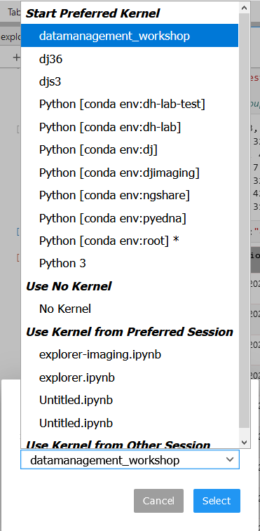

## Getting Started with Datajoint (Python)

This guide will cover what you need to do to begin working with the Electrophysiology and Imaging pipelines in user in the Moser Group at the Kavli Institute for Systems Neuroscience. 

If you have questions and/or run into problems, ask for help in the ["Support" channel](https://teams.microsoft.com/l/channel/19%3a6978d4ea8cf64eeabe3b91dd8d13c91d%40thread.skype/Support?groupId=f0c36029-e927-4135-aa7c-c303f33244cf&tenantId=09a10672-822f-4467-a5ba-5bb375967c05) in the Datajoint team on Microsoft Teams.


### Programming Language

Datajoint is available as a library in both Python and Matlab, and the database can be accessed from either language. Main development and support takes place primarily in Python, and if you are new to programming, we recommend that you use Python. Experienced Matlab or Python developers should continue using their language of choice. This guide covers the process for getting started with Datajoint in **Python**.


#### The terminal

A lot of interaction with Python will take place on the commandline. In general, we recommend that you use the Anaconda Terminal, as that interfaces well with conda environments. Examples in this page assume that you are using the anaconda terminal, and will have a layout like this
`(environment) local/path/to/working/directory $ command_to_run`
(the `$` symbol may be replaced by a `>` symbol on some systems). For example:


Where explicit commands are given in this guide, they usually look like the above, including the environment name. If you copy and and paste them, make sure you copy and paste the elements _after_, and not including, the `$` symbol (e.g., above, `python myscript.py`

Examples will typically be given _excluding_ the local path, as it is _usually_ not relevant

On Windows 10, you can open the anaconda terminal as follows:
* open the Start menu with the Windows key
* Type `anaconda` to search
* Select the `Anaconda Prompt`


#### Installing Python

Both pipelines are written for Python 3.6. Using the two-photon calcium imaging package `suite2p` requires Python 3.7. We recommend using one of the *conda* distributions of Python, and this guide will focus on installing Miniconda. These distributions include the Conda tool, which allows you to set up and manage separate Python environments for different projects to help avoid dependency conflicts. Using separate, independent, environments is _highly_ recommended. 

More information on working with Conda environments is available in the [Conda official documentation](https://docs.conda.io/projects/conda/en/latest/user-guide/tasks/manage-environments.html).


* Install [Miniconda Python 3.x](https://docs.conda.io/en/latest/miniconda.html).
  * Install in a directory that has no spaces in its path. 
  * [If on WIndows] Select the option to add Python to the Windows PATH
* Install the Jupyter tool in your base environment
  * `(base) $ conda install jupyter nb_conda_kernels`


In general, we recommend using the `conda` package manager in preference to `pip` wherever possible. Mixng the two package managers is possible, but not recommended. 

The Ephys and Imaging pipelines have subtly different requirements. Therefore, we recommend creating separate environments if you need to work with both. If you only work with one, skip the section that does not apply to you.

##### Creating an environment for Electrophysiology

* Create a new Conda environment for the **Ephys** pipeline
  * Create an environment with the following:
    * `(base) $ conda create --name ephys python=3.6`
    * Confirm creation by pressing `Y`
    * This creates an environment with the name `ephys` 
  * Activate the newly created environment to begin using it
    * `(base) $ conda activate ephys`
  * Install the minimum necessary packages
    * `(ephys) $ conda install datajoint -c conda-forge`
    * `(ephys) $ conda install graphviz python-graphviz pydotplus ipykernel`

##### Creating an environment for Imaging 

* Create a new Conda environment for the **Imaging** pipeline
  * Create an environment with the following:
    * `(base) $ conda create --name imaging python=3.7`
    * Confirm creation by pressing `Y`
    * This creates an environment with the name `imaging` 
  * Activate the environment
    * `(base) $ conda activate imaging`
  * Install the minimum necessary packages
    * `(imaging) $ conda install datajoint -c conda-forge`
    * `(imaging) $ conda install graphviz python-graphviz pydotplus ipykernel seaborn`


##### Working with Jupyter lab

The next steps are easier to execute in a Jupyter lab notebook, so let's get that set up before we continue.

Jupyter lab is a popular interactive tool for working with Python. 
It enables you to view `.ipynb` files (like the *notebooks* in folder `Helper_notebooks` in the imaging repository).
Datajoint interacts well with notebooks and renders fast previews of tables throughout the schema. 

Jupyter has an older interface "Jupyter notebook", and a newer interface "jupyter lab". Throughout this guide, we assume that you will use Jupyter lab. Other guides on the internet may look somewhat different if they use the older notebook style. 

Jupyter lab includes a file browser to navigate to your notebooks, but it is only able to navigate from the local working folder it was started in. So, for instance, if your notebooks are stored in `C:/python/my_notebooks`, then you will need to start Jupyter in one of `C:/`, `C:/python` or `C:/python/my_notebooks`. If you start from `C:/users/my_user`, you will not be able to navigate to your notebooks. This limitation _only_ applies to loading your notebooks - once inside a notebook, you can load arbitrary files from where on your computer.
* To navigate to your folder, use `cd` followed by the path, like so: 
  * `(base) $ cd C:/python`

* If that does not change the path (i.e. because you are trying to navigate to another drive), add the `/d` command:
  * `(base) $ cd /d C:/python`

You should start Jupyter lab from the `base` environment, if you followed the setup guide above. This will open Jupyter lab in your browser:
* `(base) $ jupyter lab`

You can now create a new notebook by selecting one of the notebook options in the **Launcher** on the right, or open an existing one in the folder menu on the left.

Inside the notebook user interface, you will then need to select the appropriate kernel, if you haven't already. Jupyter is able to work with separate Conda environments as "kernels", and if you need to work with multiple environments, you may have multiple notebooks open, each one pointed at a separate kernel (or environment). Click on the highlighted text, and then choose your preferred kernel. Conda environments show up prefixed by `conda env:`




To exit jupyter lab, close the browser window and use `ctrl+c` in the Anaconda prompt window


### Connecting to the pipeline database

The fundamental building block of the pipeline is the database server that stores processed data. Each pipeline is made up of one or more _schemas_, each of which contains many _tables_. 

To connect to and interrogate the pipeline, you require two things:

* Access credentials and configuration for the database
* Interface classes to the schemas and tables

Access credentials are shared between both pipelines. Configuration of data is similar, and the code below will generate a configuration file that is valid for both pipelines

#### Once-off configuration

You should only need to execute this code block once, and the computer on which it was executed will remember your configuration. The code defining `stores` is platform and computer specific: the example provided here is for a Windows computer that has mounted the `\\forskning.it.ntnu.no\ntnu\mh-kin\moser` shared network drive at `N:/`. Users on Linux or Mac, or users on Windows with a non-standard mounting, must adjust the settings below to match their local system. 

You will use your NTNU username, but the password is separate - contact Simon Ball or Haagen Wade for a password. The `ACCESS_KEY` and `SECRET_KEY` values are available on the [Kavli Wiki](https://www.ntnu.no/wiki/display/kavli/DataJoint%3A+Neuroscience+pipelines) (log in with your NTNU credentials).

* Copy this code block into a jupyter lab notebook cell and add the neccessary info before executing it:
```python
ACCESS_KEY = "" #Get alphanumeric code from the Kavli Wiki link above
SECRET_KEY = "" #Get alphanumeric code from the Kavli Wiki link above
USERNAME = "" #Use your NTNU username
PASSWORD = "" #Get password from Simon Ball or Haagen Wade

import datajoint as dj
dj.config['database.host'] = 'datajoint.it.ntnu.no'
dj.config['database.user'] = USERNAME
dj.config['database.password'] = PASSWORD
dj.config["enable_python_native_blobs"] = True
dj.config["stores"] = {
    'ephys_store': {
        'access_key': ACCESS_KEY,
        'bucket': 'ephys-store-computed',
        'endpoint': 's3.stack.it.ntnu.no:443',
        'secure': True,
        'location': '',
        'protocol': 's3',
        'secret_key': SECRET_KEY},
    'imgstore': {'location': 'N:/datajoint/imgstore',    # Adjust as necessary for local system
                 'protocol': 'file'},
          }
dj.config['custom'] = {
		'database.prefix': 'group_shared_',
		'mlims.database': 'prod_mlims_data',
        'flask.database': 'group_shared_flask',
        "dj_imaging.database":"group_imaging_1b",
        "dj_suite2p.database":"group_suite2p_1",
          }

dj.config.save_global()
```


#### Connecting to the pipelines

Interacting with either pipeline requires Python classes representing the tables in the database. These can be generated in three ways:
* Datajoint's `spawn_missing_classes` method: this creates many objects, one for each table in the schema (preferred for `imaging`)
* Datajoint's `create_virtual_module` method : this creates an object representing the schema
* Importing the Python code that describes the schema(s) (stored in Github repositories for [Ephys](https://github.com/kavli-ntnu/dj-elphys) and [Imaging](https://github.com/kavli-ntnu/dj-moser-imaging) 

If you are not sure which to pick, either one of the first two will suit you (see examples below). Due to the structure of the pipeline, option 2 is recommended for the Ephys pipeline. The final option may be of interest to advanced users planning to implement their own branch pipelines, but is not necessary for general usage. 

```python
# Example: Imaging
# Example: `spawn_missing_classes`. This gives a more Matlab-like interface,
# where all objects exist directly in the global namespace
import datajoint as dj

schema = dj.schema(dj.config["custom"]["dj_imaging.database"])
schema.spawn_missing_classes()

Session()
Cell.Rois()
Tif()

```

```python
# Example: Ephys
# Example: `create_virtual_module`. This gives a more Pythonic interface,
# where the schema exists as a top-level object, and tables are attributes
# of those top-level objects.
import datajoint as dj

ephys = dj.create_virtual_module("ephys", dj.config["custom"]["database.prefix"]+"ephys")

ephys.CuratedClustering()
ephys.Unit()
ephys.UnitSpikeTimes()
```

**Congratulations, you are now connected to and interacting with a datajoint pipeline!**


#### GUI for imaging users

* A session viewer graphical user interface  has been developed for the Imaging pipeline. Due to it's wide variety of dependences, and the necessity to install via `pip`, it is **strongly recommended** to install it in its own private environment. Make sure you have access to the [dj-imaging-user repository](https://github.com/kavli-ntnu/dj-imaging-user) before you start (if clicking the link leads to a 404 page, contact Simon for access. If not, you are all good and can proceed).
  * `(base) $ conda create --name imaging-viewer python=3.6`
  * `(base) $ conda activate imaging-viewer`
  * `(imaging-viewer) $ pip install git+https://github.com/kavli-ntnu/dj-imaging-user.git`
  * `(imaging-viewer) $ session_viewer`


##### Optional: Working with Conda Environments in Spyder

`Spyder` is a popular Python development environment. It is natively installed with any *conda* Python distribution. If you do not have it installed, you can install it with either `conda` or `pip` (it is a Python package like any other)

```python
conda install spyder
```

Spyder does not directly support either `conda` environments, or the older styles `venv` virtual environments. However, you can work with them anyway in one of two ways:

* Install `spyder` into the environment you wish to use, and use the resulting binary to run `spyder`, **or**
* Install `spyder-kernels` into the environment you wish to use, and use `spyder` installed from the `base` environment.

In the latter case, you must change `spyder` Preferences to use the appropriate Python interpreter. You can find the correct path by running the following code _inside the environment you wish to use_:

```
(ephys) $ python -c "import sys; print(sys.executable)"
```

And then copying this path to the provided textbox in `Preferences > Python Interpreter > Use the following interpreter`

Numerous other IDEs support Python. Common examples include PyCharm and Visual Studio Code

