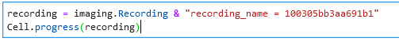

## Imaging: The basics

After completing the instructions under [Getting Started](https://moser-pipelines.readthedocs.io/en/latest/common/getting_started/index.html), these next steps will show you how to add data to the pipeline and evaluate some of its outputs (which cells does it identify and what are their functional properties?).

### Add imaging data to the pipeline
The easiest way to do this is via the [Web GUI](http://2p.neuroballs.net:5000/) for which you can find detailed instructions [here](https://moser-pipelines.readthedocs.io/en/latest/imaging/How-to-add-sessions.html).
If you are just getting started with the pipeline, these steps might be a good place to start:

* Go to the [imaging web GUI](http://2p.neuroballs.net:5000/) and log in (ask Simon Ball or Horst Obenhaus for log in credentials if this is the first time you're logging in)
* Go to _BaseFolder_ -> _Add BaseFolder_
* Fill in the form as follows:
    * **Experimenter:** select your username from the list.
    * **File path:** specify the file path to where your raw data is stored.
    * **Combined?:** should the data within this folder be analysed together? **Miniscope users:** maybe you recorded images while the mouse was running on a wheel before you started a *new* recording with the mouse in an open field. In this case, you might want the cells from both sessions to be analysed together, as they are likely the same in both, so *Combined=yes*. In contrast, you may have removed the microscope in between these two sessions, meaning you may have different cells in your field of view. In this case, *Combined=no*. **Femtonics users:** *Combined* should always be set to *no*.
    * **Setup:** Select which microscope type you used (Illuminato = Femtonics).
    * **Scope model:** for miniscope users only, select which model you used.
    * **Animal ID in mLIMS:** the animal ID of your furry collaborator as registered in mLIMS. 
    * **Suite2P python options:** this selection determines how Suite2p, which is incorporated into the pipeline, analyses your data. You can make your own set of options that work best with your data, but for now just choose an existing one and see how that works. **Miniscope users:** choose an option that matches the indicator you're using. **Femtonics users:** flavio-develop is a good place to start. 

*Image showing an example of how to add data from the Femtonics microscope to the imaging pipeline via the imaging web GUI.*

* Click *Submit*
* Go to *BaseFolder* -> *BaseFolders* to see the status of your data entry. If any errors have popped up, contact Simon Ball or Horst Obenhaus for help.
* Once Suite2p has finished running, you will be able to see your data listed under *Suite2p* -> *Finished Suite2p Jobs* (depending on the data, this can take anything from minutes to hours).
* After Suite2p has done its thing, it's time to take a look at the cells it identified and decide which ones should be added to the pipeline (see below).

### Evaluate the cells Suite2p identified in your data
Suite2p is an imaging processing pipeline for registering images and detecting cells and spikes. It is written by Carsen Stringer and Marius Pachitariu. To sort through the cells it has identified in your data, discarding artefacts etc that shouldn't be added to the pipeline, you first need to install Suite2p locally so you can use the Suite2p GUI.

#### Install Suite2p
If you are familiar with git, you can follow the installation instructions in the [suite2p documentation](https://suite2p.readthedocs.io/en/latest/installation.html). If not, then these steps might be more intuitive:
* Download [GitHub Desktop](https://desktop.github.com/) (this is a useful program for interfacing with GitHub, learn more [here](https://docs.github.com/en/desktop/installing-and-configuring-github-desktop/getting-started-with-github-desktop)).
* Within GitHub Desktop, go to *File -> Clone repository...*
* Select the *URL* tab, add the link to the suite2p repository (https://github.com/MouseLand/suite2p) and select a location in which to save it (e.g. locally on your computer).
* Click *Clone*
* Open an Anaconda Prompt and change the directory to where the `environment.yml` file in the suite2p repository folder is, e.g.:
    * `(base) $ cd C:\User\me\Code\suite2p`
* Create a separate suite2p environment based on the `environment.yml` file
    * `(base) $ conda env create -f environment.yml`
* Activate the new suite2p environment 
    * `(base) $ conda activate suite2p`
* Install suite2p
    * `(suite2p) $ pip install suite2p`

#### Identify cells to keep
With suite2p installed, you can open the GUI via the Anaconda Prompt after activating the suite2p environment:
* `(suite2p) $ suite2p`

You can find the documentation for how to use the GUI [here](https://suite2p.readthedocs.io/en/latest/gui.html), but here are a few basic steps to get your started:
* Locate the stat.npy file that suite2p generated when it ran through your analysis (the path may look something like this: 
`N:\Ragnhild\Mouse 000\YearMonthDate\MUnit_0\suite2p\plane0` or like this: `N:\Ragnhild\Mouse 000\YearMonthDate\combined_xxx\mini2p_GC6m1\plane0`. Details on the folder logic can be found [here](https://moser-pipelines.readthedocs.io/en/latest/imaging/Folder-logic.html#suite2p).
* Drag and drop the stat.npy file into the suite2p GUI or open it via *File -> Load processed data* in the GUI.
* Use the buttons along the top of the GUI to determine your view (the buttons named *cells - both - not cells*): click *both* to see the ROIs that suite2p has picked out as cells on the left, and ROIs that it has discarded on the right.
* Left click any ROI to see its associated trace at the bottom of the GUI.
* Right click any ROI to move it from one category to another (e.g. right clicking on an ROI in the *cells* panel will move it to the *not cells* panel). NOTE: changes are saved automatically to the stat.npy file.
* When you have finished, i.e. you have all the ROIs you want to keep in the *cells* window, go back to *Suite2p* -> *Finished Suite2p Jobs* in the web GUI
* Click the *Add* button by your session **only once** to tell the pipeline to incorporate the ROIs you have selected. The pipeline will now calculate ratemaps etc for every ROI - this will take time.
* While the pipeline is working hard  adding your cells, you can take a well deserved break and check the progress by, for example, following these steps: 

    * Identify the *Session hash* of your session by filtering under *Sessions* in the imaging web GUI. 
    * Execute these commands within a jupyter notebook, using your session hash between the double quotes:

NOTE: if you decide to re-sort the ROIs, you can follow the exact same steps, including using the *Add* button to notify the pipeline of the change, but only click *Add* **after the progress indicator has reached 100%.** If the *Add* button is no longer there (because it has been more that 14 days), you can [re-add the Basefolder](https://moser-pipelines.readthedocs.io/en/latest/imaging/How-to-add-sessions.html#what-happens-if-i-don-t-like-this-or-that-cell-from-the-suite2p-output).

If suite2p hasn't done a good job of identifying cells, it may be worth creating your own options file with settings tuned specifically to your data (see below).

#### Create a new suite2p options file for your data
For inspiration, check out the current option files being used, and their contents, in the [imaging web GUI](http://2p.neuroballs.net:5000/) under *Suite2p -> Manage Suite2P Options*. 

To create your own:
* Open the suite2p GUI and go to *File -> Run suite2p*
* Modify the options to you want to change.
* Click 'Save ops to file' to save a new options file.
* Test these new options on your data (without involving the pipeline):
    * Click *Add directory to data_path* to choose the folder that contains your raw data.
    * If you already have a suite2p folder in that location, move it to another folder if you want to keep it, or delete it.
    * Click *RUN SUITE2P* (the panel below will show the analysis progress and let you know when it's finished).
    * The analysis output will automatically load into the suite2p GUI where you can evaluate it.
* When you are happy with your modified options, make this new options file available in the imaging web GUI by uploading it under *Suite2p -> Add Suite2p Options*
* [Notify the pipeline to use the new ROIs you've obtained on your data](https://moser-pipelines.readthedocs.io/en/latest/imaging/How-to-add-sessions.html#what-happens-if-i-don-t-like-this-or-that-cell-from-the-suite2p-output).

### Check out the functional properties of your cells
Your data has been ingested and cells identified, so now it's finally time to check if they have any interesting properties! Datajoint automatically calculates all sorts of things for you, including each cell's ratemap and grid score, and a nice way to look at them is via the [Session Viewer GUI](https://moser-pipelines.readthedocs.io/en/latest/imaging/Session-viewer-GUI.html) made by Horst Obenhaus. The documentation that link leads to also tells you which tables the GUI is collecting the data from, which is a helpful reference for when you start fetching and plotting data from the pipeline on your own. 

You're now ready to delve deeper into the pipeline and start analysing all your cool data. **May all your analysis dreams come true!** (but if they don't, the [Support](https://teams.microsoft.com/l/channel/19%3a6978d4ea8cf64eeabe3b91dd8d13c91d%40thread.skype/Support?groupId=f0c36029-e927-4135-aa7c-c303f33244cf&tenantId=09a10672-822f-4467-a5ba-5bb375967c05) channel on Teams is here to help)