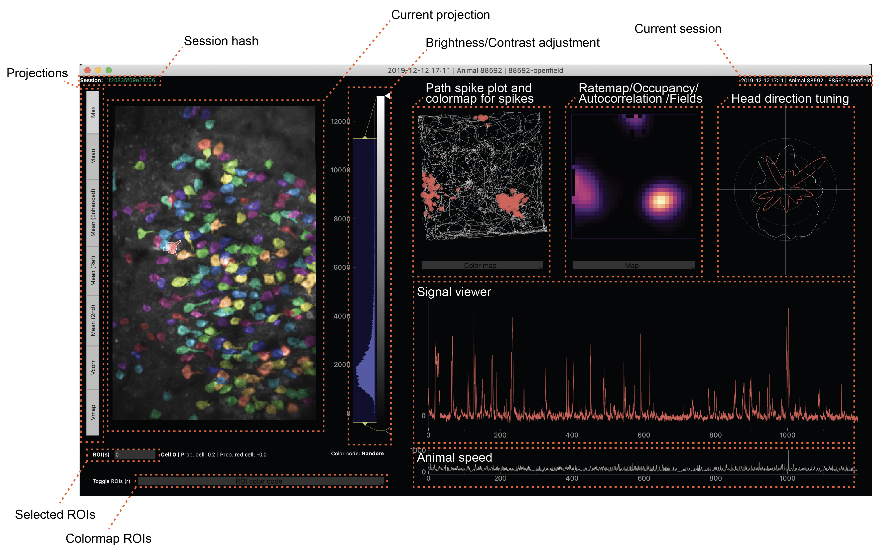
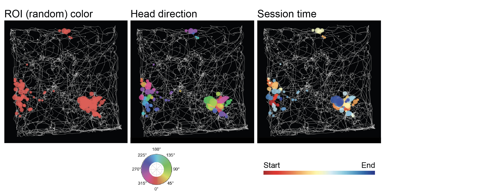
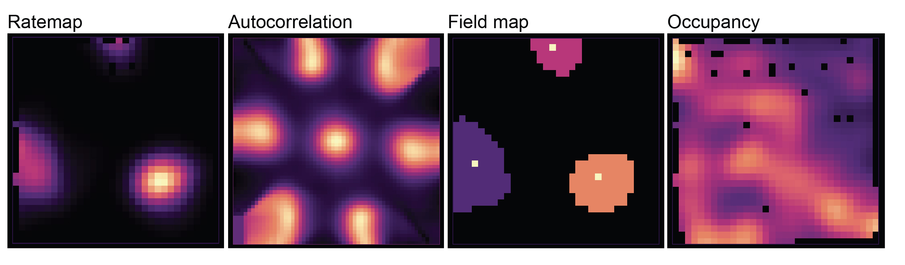

## Imaging: Session Viewer

The [session viewer GUI](https://github.com/kavli-ntnu/dj-moser-imaging/tree/master/viewer) allows experimenters to display results saved in datajoint. For this, the user needs to be able to connect to the database and the external drive that datajoint imaging results are saved under. The best way to test this is via the helper notebooks, e.g. [here](https://github.com/kavli-ntnu/dj-moser-imaging/blob/master/Helper_notebooks/Starting%20notebook.ipynb).

### Installation
The Session Viewer requires dependencies not enumerated in [Getting Started](../common/getting_started/python):
* pyqt
* pyqtgraph
* scipy
* scikit-image
* pymysql

Make sure you have the right conda environment activated before you proceed (the one you created during installation of the dj moser imaging pipeline). You can start the GUI by changing directory to `/viewer` and typing `python main.py`

### Overview
Once started, you can copy+paste a session hash into the text field on the top left and press enter (next to **Session:**). This will load and display this session from the database. Session hash refers to the `session_name` attribute of every session in datajoint. 
 
 

The main window is separated into a projection view (left), analysis views for experiments run in 2D environments (top right), a signal viewer (middle right), and a speed plot (bottom right). The GUI is able to display head fixed recordings as well (the top right plots will stay black). 
Upon loading a new session, projections/tracking/occupancy will be loaded from the database. Whenever the user clicks on a ROI on the left, the results for this ROI will be displayed on the right. Most plots allow zooming via the mouse wheel.

### Keyboard shortcuts
Projection viewer
- `R` Show/hide ROIs. This will hide the color overlay of all ROIs and only show white outlines of selected ROIs.
- `N` Show/hide ROI numbers in projection view

Signal viewer 
- `S` Show/hide deconvolved spikes
- `D` Show/hide fluorescent trace(s)

Parameter selection
- `P` Opens parameter selection window

### Multiple ROIs
Multiple ROIs can be selected by either pressing down the `shift` key while clicking on ROIs or by typing out a comma separated list of valid ROI numbers into the field next to **ROI(s)** underneath the projection viewer and pressing enter. When multiple ROIs are selected, the results will be plotted together in the plots on the top right. Exceptions to this are the 2D occupancy view and field maps, which only shows the result of the last selected ROI.

### What is displayed
#### Projection views
All results saved under `Projection()` or `ProjectionCorr()` in datajoint. ROI positions/pixels are loaded from `Cell.Rois()` or `RoisCorr()`. Whether corrected results are loaded or raw (/uncorrected) results only depends on whether a corrected result is available. Outlines and colormaps are calculated on the flow by retrieving results from matching tables in the database. The numbers match the `cell_id` attribute in datajoint. 
 
 
_**Colormaps**_: 
- Random: Random colors that are also used for spikes in the path spike view, head direction tuning plot, and for signal and spikes in the signal viewer on the right. 
- SNR: Signal to noise ratio (deltaF/F trace), loaded from `SNR()`
- Spatial info content: Spatial information content loaded from `Ratemap.Stats()`
- Gridscore: Loaded from `GridScore()`
- MVL: Mean vector length (head direction tuning), loaded from `AngularRate.Stats()`.
- Borderscore: Loaded from `BorderScore()`

The brightness and contrast of this figure can be adjusted by modifying the histogram handles displayed next to the projection viewer (see "Brightness/Contrast adjustment" in figure above). The brightness/contrast of every projection view can be individually adjusted. 

#### Path spike plot
Displays the path retrieved from `Tracking()` and deconvolved spikes from `FilteredSpikes()`. The spike dot size corresponds to their amplitude. By clicking on the drop down menu underneath, several colormaps can be chosen:

#### Ratemap / ... plots
Displays the 2D ratemap by default (retrieved from `Ratemap()`). By clicking on the drop down menu underneath, several other maps can be chosen:

- Autocorrelation: 2D autocorr (`acorr`) from `GridScore()`.
- Field map: All fields extracted from current ratemap, retrieved from `Ratemap.Fields()`. Bright dots indicate field centroids (attribute `field_centroid_x`/`field_centroid_y`), which are overlaid after drawing the fields themselves. 
-  Occupancy: 2D occupancy retrieved from `Occupancy()`.

#### Head direction tuning
Results are retrieved from `AngularOccupancy()` (occupancy in white) and `AngularRate()`. 

### Signal viewer
Neuropil corrected traces from `Cell.Traces()` (attribute `fcorr`, channel `primary`) and deconvolved spikes from `FilteredSpikes()`. 

#### Animal speed 
This is the `speed` attribute retrieved either from `Tracking.OpenField()` (for 2D tracked sessions) or `Tracking.Linear()` for head fixed (1D) sessions.

### Parameter selection
By typing `P`, a parameter selection window can be opened. This displays parameter sets throughout datajoint (look up tables) that results for this session depend on. Selecting a different parameter set will auto-reload results and refresh their views in the main window. Only parameter sets that are available (= have results calculated) for this session are shown. By clicking the triangle displayed next to each parameter set, an overview of the different parameter sets and each parameter can be shown. 

### Save figures
Some plots allow right clicks to display context menus. These menus allow export of the selected plots (both as pixel as well as vector graphics).