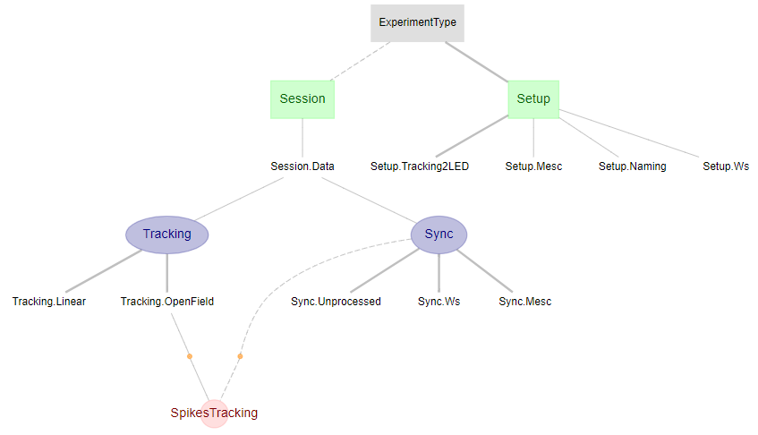
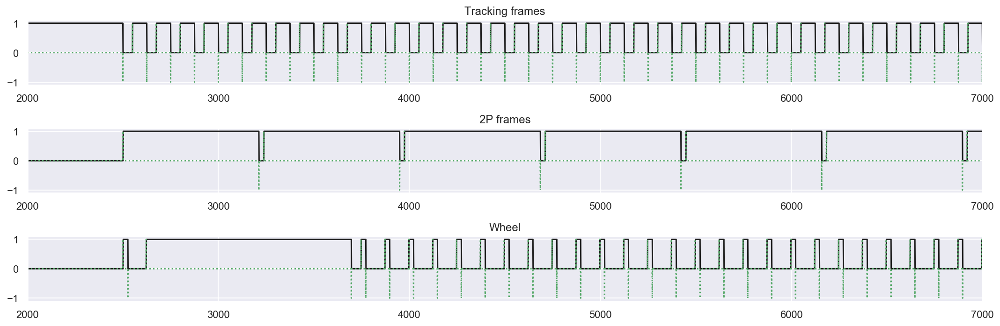
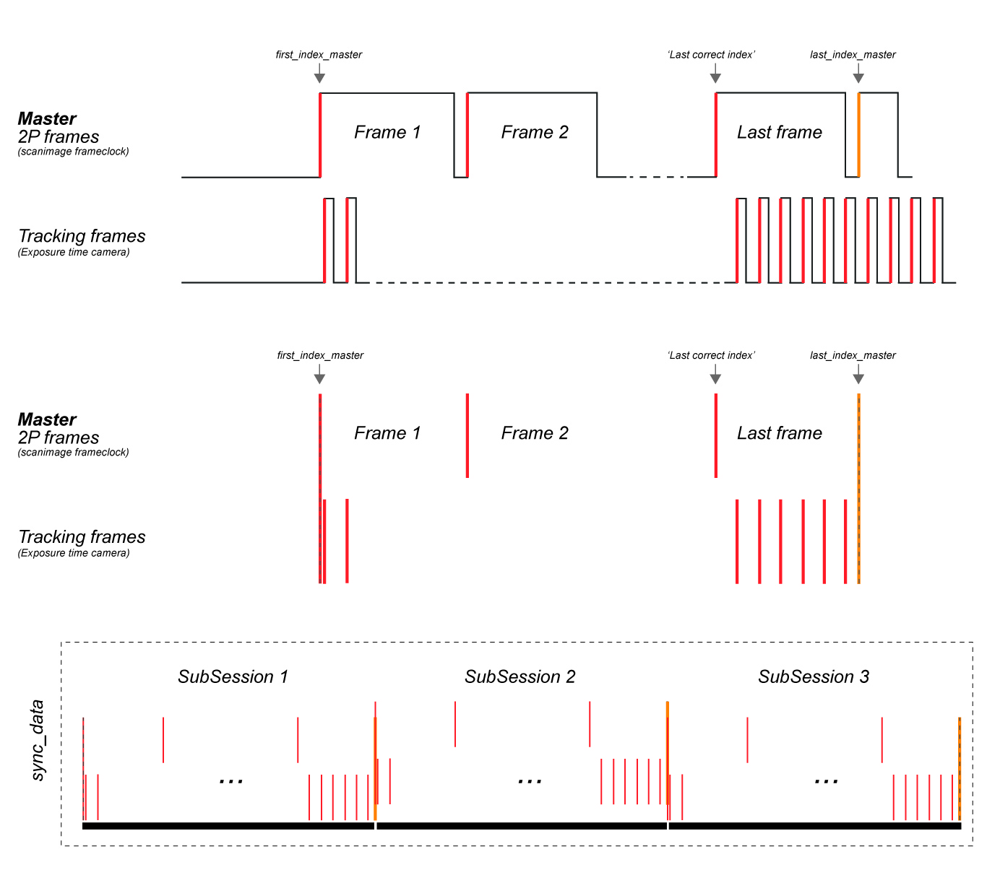

## Imaging: Synchronisation

For the 2P miniscope setup, [Wavesurfer](http://wavesurfer.janelia.org/) is used for synchronisation of imaging and other (tracking, running wheel, ...) acquisition streams. Wavesurfer records the stream of (digital) input signals on different ports of a NI card. The frame clock is recorded (exported from [ScanImage](http://scanimage.vidriotechnologies.com/display/SIH/ScanImage+Home)) and serves as the master event stream to which other events are aligned. A wavesurfer reader class that extracts the digital streams from wavesurfer's hdf5 container format can be found under [/helpers/mini2p_wavesurfer.py](https://github.com/kavli-ntnu/dj-moser-imaging/blob/master/helpers/mini2p_wavesurfer.py). 

For the femtonics setup (.mesc files), the internal oscilloscope function is used to record events in sync with acquisition (see [/helpers/femto_mesc.py](https://github.com/kavli-ntnu/dj-moser-imaging/blob/master/helpers/femto_mesc.py)).

Ingest of sync data happens in the `Sync` table (see /dj_schemas/sync.py). For this, sync data is extracted according to dataset type (*Wavesurfer* vs. *MESC* vs. ...). Each experiment type (e.g. *femtonics*,*2Pminiscope_A*) has an entry under `Setup`, which holds at least the *polarity* and for Wavesurfer files also info about which stream served as master and which tolerance to allow between the end of sync streams. The `Naming` part table allows downstream processes to infer what specific sync streams were called and to retrieve them accordingly. For example, if a table requires sync data for rotary (wheel) tracking data, it will query the `Naming` table to retrieve the name of the sync stream for that particular setup. That sync stream can then be retrieved from the main `Sync` table. 
 

### Wavesurfer sync

Below is an example of the raw recording of 3 sync streams (digital inputs) via wavesurfer. After an initial delay, the acquisition is triggered and the scanning starts (*2P frames*, master). At the same time the camera for tracking of 2 LEDs is triggered and every exposure is registered (*Tracking frames*). The (*Wheel*) stream records serial events that are sent from a microcontroller that is registering data from a rotary encoder attached to a running wheel (irregular since script wasn't running). 

Events are extracted according to polarity (red vertical bars, rising or falling edge, tracking frames should be shown inverted to match example above). A *last_index_master* is inferred (since not actually recorded) and the other sync streams are cut accordingly. To concatenate multiple (sub-)sessions, sync streams are zeroed on master (*first_index_master*)  and every subsequent sync stream is concatenated to the previous one adding 1 to *last_index_master*.

