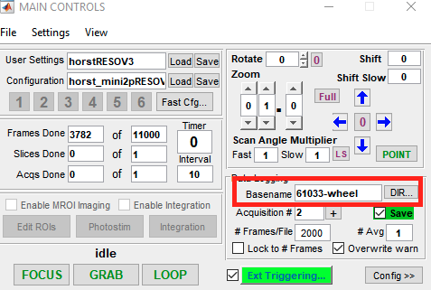
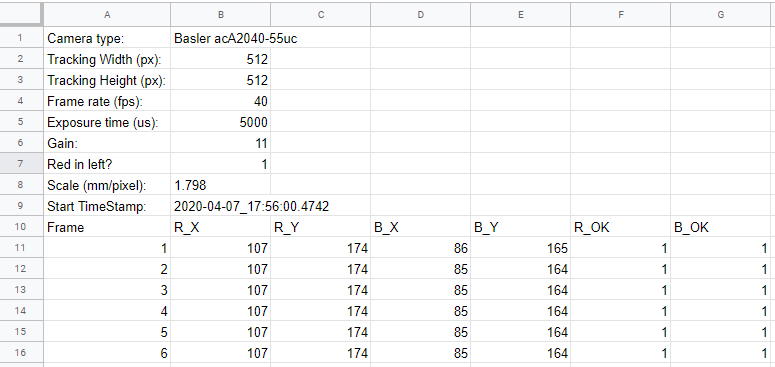
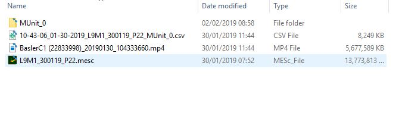
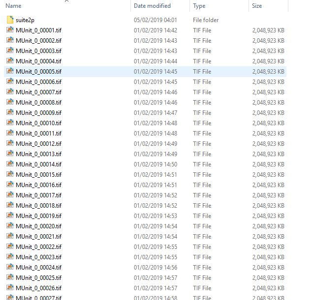

## Imaging: Naming and Folder logic

Ingest of raw/processed data folders follows a certain logic determined by the corresponding "Experiment type".

### Miniscope
The **2Pminiscope_A** import logic is as follows:
- The base folder contains raw scanimage .tif files that follow a certain naming scheme:
    - `basename_filenumber_filenumber.tif`

- Wavesurfer synchronisation files (`basename_session.h5`)
- Tracking 1D files (`basename_session_WHEEL.csv`)
- Tracking 2D files (`basename_session.csv`)
- Tracking videos (`basename_session.avi`)
- Subfolder(s) for analysis output of suite2p python package (see below for suite2p directory structure)

_Example:_


**Important!** 
Because the current ingest routine extracts a basename and timeseries name based on the assumption that the *basename* is buried in the filename like `basename_filenumber_filenumber.tif`, there should not be any underscores `_` within the basename. For example: 
- `94557-imaging-20201013-withcookie_00002.tif` is **valid** and will lead to the basename `94557-imaging-20201013-withcookie`
- `94557_imaging_20201013_withcookie_00002.tif` is **invalid** (or rather will confuse the basename / timeseries name extraction)

It is best to specify the `basename` in scanimage before you start an acquisition. **Please do not include any `_` in that text field.**.
For more info check out the "Imaging Web GUI" page in this documentation. 



____

### Miniscope preprocessed
The ingestion routine is similar to that of the ***Miniscope*** above. Some major differences include:
1. For preprocessed tif stack, the tif files are prepended with `_preproc` - e.g. `basename_session_filenumber_preproc.tif`
2. The raw tif files are expected to be present as well
3. For preprocessed tracking data, the name of tracking file is appended with `_preproc` - e.g. `basename_preproc.csv`
    + this tracking data is assumed to be time synchronized with the imaging acquisition
    + this tracking csv file contains some meta information (see example below)
4. All intermediate preprocessed files are placed in a folder named `preprocessed` to be registered and tracked by the pipeline
 
_Examples:_

_root_


 
 _root/basename_preproc.csv_
 


 ____

### Suite2p

Suite2p analysis outputs are stored in subfolder(s) of the root directory in the following naming convention:
+ `combined*`: folder storing outputs of suite2p analysis on the session-combined data in this directory
+ `split_<basename>*`: folder storing outputs of suite2p analysis on the individual session data in this directory

Within the `combine` or `split_basename` directory, the following suite2p-related subfolders can be found:

```
root_data_dir/
└───combined/
│   └───suite2p/
│   │   │   ops1.npy
│   │   └───plane0/
│   │   │   │   ops.npy
│   │   │   │   F.npy
│   │   │   │   iscell.npy
│   │   │   │   ...
│   │   └───plane1/
│   │   │   │   ops.npy
│   │   │   │   F.npy
│   │   │   │   iscell.npy
│   │   │   │   ...
└───split_basename/
│   └───suite2p/
│   │   │   ops1.npy
│   │   └───combined/
│   │   │   │   ops.npy
│   │   │   │   F.npy
│   │   │   │   iscell.npy
│   │   │   │   ...
│   │   └───plane0/
│   │   │   │   ops.npy
│   │   │   │   F.npy
│   │   │   │   iscell.npy
│   │   │   │   ...
│   │   └───plane1/
│   │   │   │   ops.npy
│   │   │   │   F.npy
│   │   │   │   iscell.npy
│   │   │   │   ...
```

***NOTE:*** the `combined` suite2p's folder represent multiplane-combined suite2p output, which is generated when users 
specify the `combine=True` option in the suite2p analysis options. 
If present, the DataJoint imaging pipeline will opt to ingest cell information from the `combined` folder over the individual per-plane folders.

_Example:_

_root/split_82951_2595624e4d44f92b/suite2p_


____

### Femtonics
The **femtonics** import logic is as follows (*only "combined = no" allowed!*):
- The base folder contains `.mesc` files
- These .mesc files and contained image series represent individual sessions
- For every one of these sessions there can be additional files: 
    - Tracking rotary encoder or optical mouse tracking files (.csv) - must contain .mesc container session identifier (`MUnit_NUMBER`). The different files are identified during pre-processing based on their header.
    - Tracking video files (.mp4) - must contain .mesc container session identifier (`MUnit_NUMBER`)

    - Sub folders called somewhat like the .mesc container session identifiers with:
        - Raw tif(s)
        - Suite2p python analysis output (`suite2p` folder)
        - Relic from Suite2P Matlab: Additional subfolder called "Plane 1" (because image acquisition is single plane
            and Suite2P automatically names it like this) with processed tifs 

_Example:_

_Root Folder_



_Session (Sub)Folder (MUnit_0 above)_



 ____

## DeepLabCut

DLC analysis outputs stored in subfolder of the root directory in the following naming convention:

    <basename>_dlc
    
_Example:_

  
    
Contained within the `<basename>_dlc` folder are the DLC outputs, including:
+ .yamel   : the configuration file (.yamel) used for this DLC analysis
+ .h5      : the tracked body part outputs from DLC analysis
+ .pickle  : the meta information file (.pickle) about this run

_Example:_


#### Multiple DLC outputs
If the `<basename>_dlc` folder contains multiple set of DLC outputs - e.g. multiple ***.h5*** and ***.pickle*** files, 
the DLC output data will be concatenated in the file order.

_Example:_


