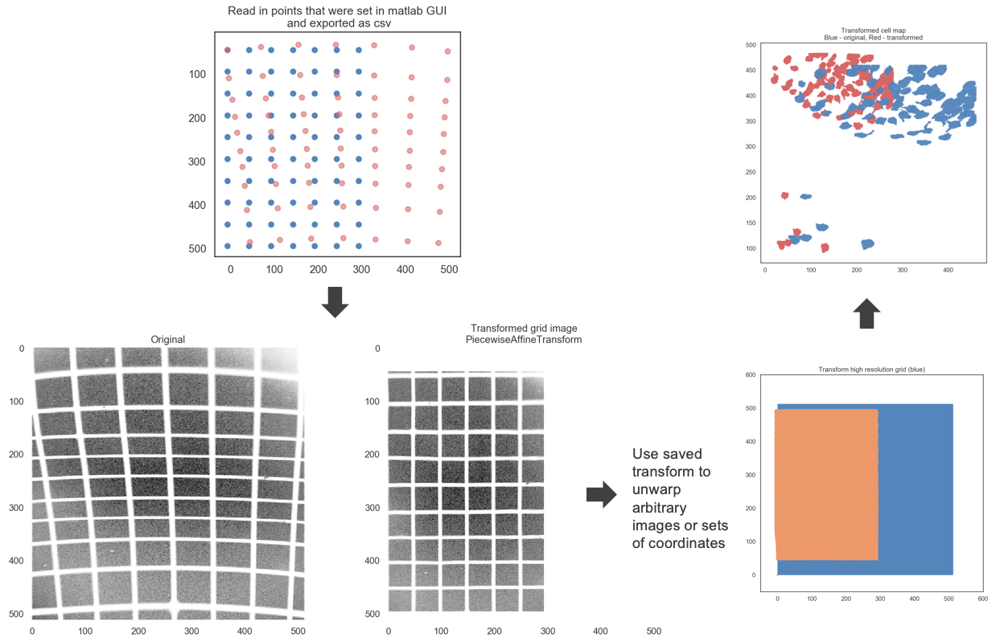

Miniscope images have to be unwarped since scanner irregularities cause distortions in the imaged field of view (FOV). 

For this, information has to first be saved in the `ImagingFOVRaw` table, which is defined by Setup and Scope entries and a zoom factor. It holds information about a single imaged grid from which spacing and distortions can be extracted/corrected. 50 micron Thorlabs standard grids seem to work fine for all purposes, but finer grid spacings might be desirable for even higher accuracy. The experimenter has to have some means of defining anchor points on the imaged grid and define what these anchor points should be warped into, e.g. an isotropic grid. This is done in a MATLAB GUI at the moment. Point pairs from this GUI are exported as .csv and inserted into the `ImagingFOVRaw` table. 

A **helper notebook** that facilitates this process can be found [here](https://github.com/kavli-ntnu/dj-moser-imaging/blob/master/Helper_notebooks/Insert%20FOV%20unwarping.ipynb). 

From there `ImagingFOV` calculates the grid spacing in pixels, a calibration factor (px to microns) and the affine transformations (see scikit image [documentation](https://scikit-image.org/docs/dev/api/skimage.transform.html#skimage.transform.PiecewiseAffineTransform)).

The information from `ImagingFOV` is then used to unwarp all `Projection` table and some of the `Cell.Rois` table entries.

See below for an outline of the process. First image on the top left depicts user defined point pairs defined the Matlab GUI (**red**: Original, warped image. **blue**: unwarped points (the goal), user defines only the red points, the blue points are inferred). 
  

