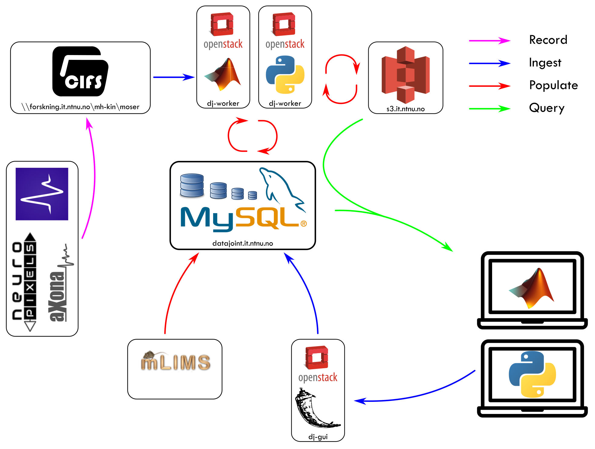

## Datajoint Pipeline Architecture

The data pipelines in use in the Moser group require numerous computers to communicate and operate with each other. The components are _mostly_ shared between the two pipelines, but with some key differences

### Shared Components

* [Database server](database.md): a physical computer hosting a MySQL database server. This stores the tables that make up the pipeline
* mLIMs: Animal colony management.
* Network drive (`\\forskning.it.ntnu.no\ntnu\mh-kin\moser\`): The network drive where raw recordings are stored
* Object Storage (`ceph`): An s3-compatible storage system for storing processed "blob" data for the database. Accessed _only_ through the Datajoint/database interface. 
* [dj-GUI](https://datajoint.kavli.org.ntnu.no): The joint web interface ([source code repository](https://github.com/kavli-ntnu/dj-GUI)). Virtual machine running on NTNU's Openstack
* [dj-docs](https://github.com/kavli-ntnu/dj-docs): the pipeline documentation
* Opexebo: Python-based analysis functions ([source code repository](https://github.com/kavli-ntnu/opexebo))
* BNT: Matlab-based analysis functions ([source code repository](https://bitbucket.org/cnc-ntnu/bnt/wiki/Home))

### Electrophysiology Pipeline

* [dj-elphys](https://github.com/kavli-ntnu/dj-elphys): the source code repository for the ephys pipeline. 
* dj-worker: Automatic population of the core ephys pipeline. Virtual machine running on NTNU's Openstack. Currently limited to Python calculations only

### Imaging Pipeline

* [dj-moser-imaging](https://github.com/kavli-ntnu/dj-moser-imaging): the source code repository for the imaging pipeline
* Dirk: Intermediary storage server. Synology NAS hosted in Kavli Institute

